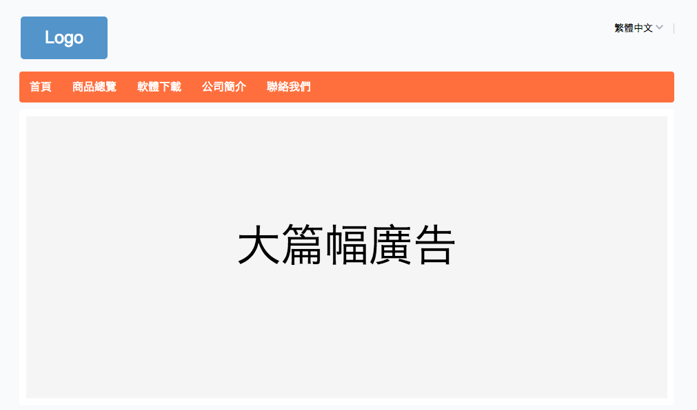
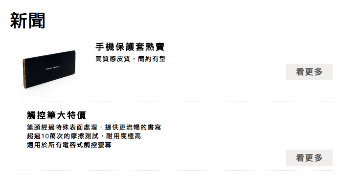
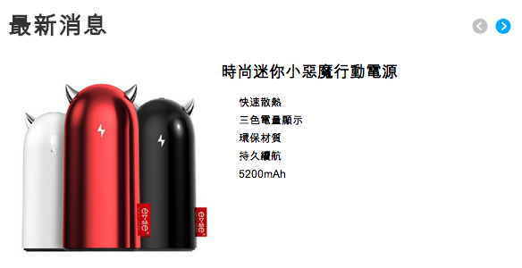
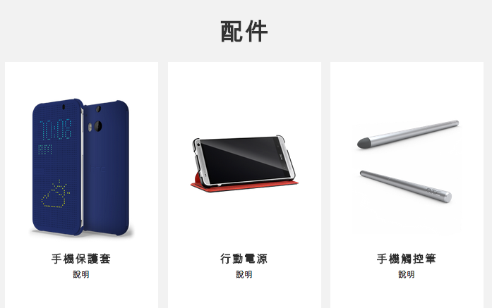
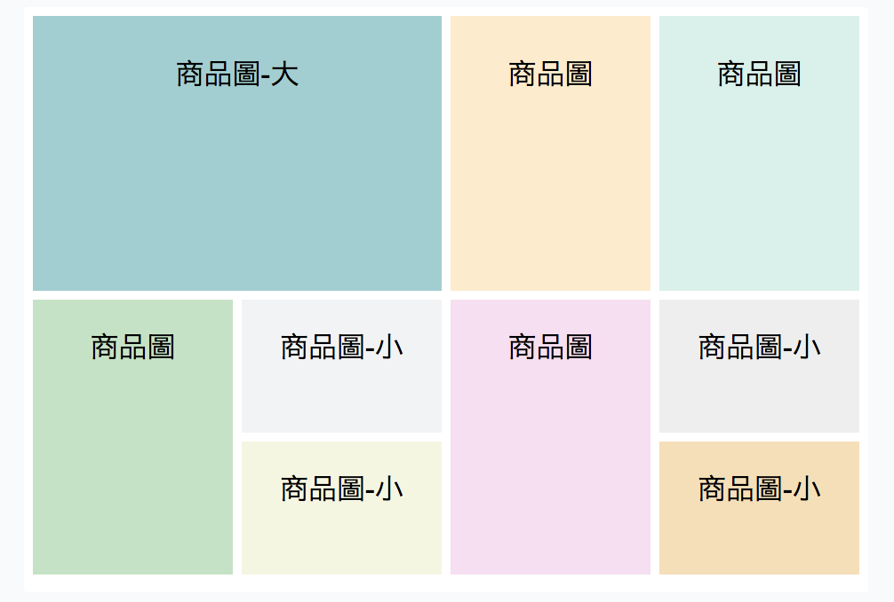
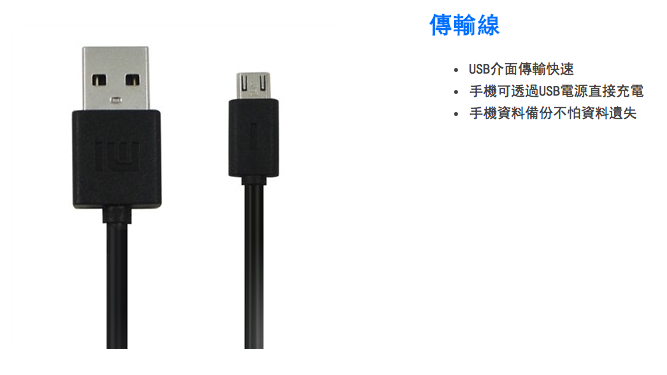
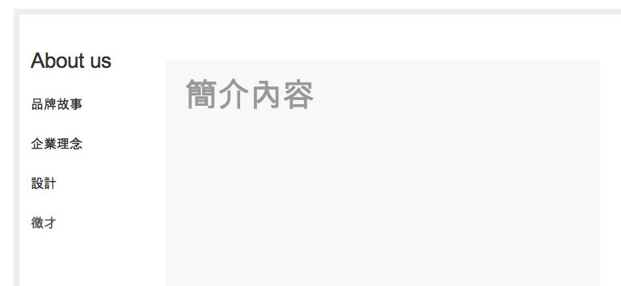

#網站設計

1. ##首頁
	* ###各個頁面的連結
	* ###大篇幅廣告 - 呈現最新或主打的商品
	
		
	
	* ###新聞
		放在「大篇幅廣告」下面，點了`看更多`會打開完整新聞頁
		
		1. 樣式（1）：一條一條列出來
				
		
		1. 樣式（2）：橫向捲動
			
	
1. ##商品頁
	* 商品 `按廠牌` 分類, 點進去會打開 商品規格 頁
	
	1. 樣式（1）：照片搭配說明文字（或廠牌）
		
			
	2. 樣式（2）：凸顯主打的配件
		
	
	* ###商品規格
	
		（左）商品圖片 + （右）特色、詳細規格介紹
	
		
	
1. ##軟體下載

	* 用列表呈現，點選直接下載

1. ##公司簡介

	

	
	經營理念

1. ##聯絡我們

	* 左半部：公司 `logo` 或 `照片`
	* 右半部：`電話`，`email`，`地址`
	* 其他可以選擇：
		1. 地圖 Google Map
		1. 線上留言板